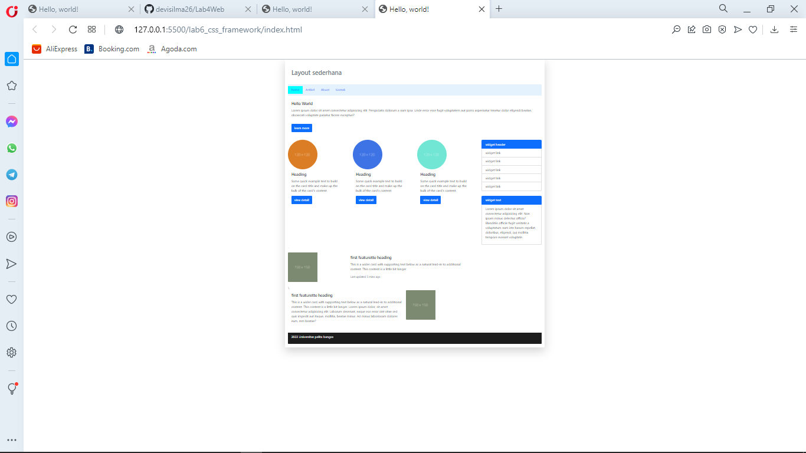

| Devi Silma Yuniar | 312010458 |
|-------------------|-----------|
| pemrograman Web   | Lab6Web   |

## lab 6 web
## framework boostrap 

adalah framework css yang sudash tersedia dengan beberapa versi yang terbaru adalah versi 5.

## membuat layout



ini adalah contoh full layout nya

**code html**

```html
<!doctype html>
<html lang="en">

<head>
    <!-- Required meta tags -->
    <meta charset="utf-8">
    <meta name="viewport" content="width=device-width, initial-scale=1">

    <!-- Bootstrap CSS -->
    <link href="https://cdn.jsdelivr.net/npm/bootstrap@5.0.2/dist/css/bootstrap.min.css" rel="stylesheet"
        integrity="sha384-EVSTQN3/azprG1Anm3QDgpJLIm9Nao0Yz1ztcQTwFspd3yD65VohhpuuCOmLASjC" crossorigin="anonymous">

    <title>Hello, world!</title>
</head>

<body>
    <div class="container-md shadow-lg p-3 mb-5 bg-body rounded">
        <div class="card-body">
            <h2 class="py-3 text-muted">Layout sederhana</h2>

        </div>

        <nav class="navbar navbar-light" style="background-color: #e3f2fd;">
            <ul class="nav">
                <li class="nav-item">
                    <a class="nav-link active" aria-current="page" href="#" style="background-color: cyan;">home</a>
                </li>
                <li class="nav-item">
                    <a class="nav-link" href="#">Artikel</a>
                </li>
                <li class="nav-item">
                    <a class="nav-link" href="#">Abuot</a>
                </li>
                <li class="nav-item">
                <li class="nav-item">
                    <a href="#" class="nav-link">Kontak</a>
                </li>
                </li>
            </ul>
        </nav>
        <div class="card py-3" style="border: 0;">
            <div class="card-body">
                <h5 class="card-title">Hello World</h5>
                <p class="card-text pb-3">Lorem ipsum dolor sit amet consectetur adipisicing elit. Perspiciatis dolorum
                    a nam ipsa. Unde error esse fugit voluptatem aut porro aspernatur tenetur dolor eligendi beatae,
                    obcaecati voluptate pariatur facere excepturi?.</p>
                <a href="#" class="btn btn-primary">learn more</a>
            </div>

            <div class="row row-cols-4">
                <div class="col">
                    <div class="card mt-4" style="width: 18rem; border: 0;">
                        
                        <div class="card-body">
                            <h5 class="card-title">Heading</h5>
                            <p class="card-text">Some quick example text to build on the card title and make up the bulk
                                of the card's content.</p>
                            <a href="#" class="btn btn-primary">view detail</a>
                        </div>
                    </div>
                </div>
                <div class="col">
                    <div class="card mt-4" style="width: 18rem; border: 0;">
                        
                        <div class="card-body">
                            <h5 class="card-title">Heading</h5>
                            <p class="card-text">Some quick example text to build on the card title and make up the bulk
                                of the card's content.</p>
                            <a href="#" class="btn btn-primary">view detail</a>
                        </div>
                    </div>
                </div>
                <div class="col">
                    <div class="card mt-4" style="width: 18rem; border: 0;">
                        
                        <div class="card-body">
                            <h5 class="card-title">Heading</h5>
                            <p class="card-text">Some quick example text to build on the card title and make up the bulk
                                of the card's content.</p>
                            <a href="#" class="btn btn-primary">view detail</a>
                        </div>
                    </div>
                </div>
                <div class="col">
                    <div class="list-group mt-4">
                        <a href="#" class="list-group-item list-group-item-action active" aria-current="true">
                            widget header

                        </a>
                        <a href="#" class="list-group-item list-group-item-action">widget link</a>
                        <a href="#" class="list-group-item list-group-item-action">widget link</a>
                        <a href="#" class="list-group-item list-group-item-action">widget link</a>
                        <a href="#" class="list-group-item list-gruop-item-action">widget link</a>
                        <a href="#" class="list-group-item list gruop-item-action">widget link</a>
                    </div>
                    <div class="list-group mt-4">
                        <a href="#" class="list-group-item list-group-item-action active" aria-current="true">
                            widget text
                        </a>
                        <a href="#" class="list-group-item list-group-item-action">
                            <p>Lorem ipsum dolor sit amet consectetur adipisicing elit. Non ipsam minus delectus
                                officia? Blanditiis officiis fugit veritatis a voluptatum nam iste harum repellat,
                                doloribus, eligendi, qui mollitia tempore eveniet voluptate.</p>
                        </a>

                    </div>
                </div>
            </div>.
        </div>
        <div class="row">
            <div class="col-8-lg">
                <div class="card mb-3" style="width: 900px; border: 0;">
                    <div class="row g-0">
                        <div class="col-md-4">
                            
                        </div>
                        <div class="col-md-8">
                            <div class="card-body">
                                <h5 class="card-title">first featurette heading</h5>
                                <p class="card-text">This is a wider card with supporting text below as a natural
                                    lead-in to additional content. This content is a little bit longer.</p>
                                <p class="card-text"><small class="text-muted">Last updated 3 mins ago</small></p>
                            </div>
                        </div>
                    </div>
                </div>
            </div>
        </div>\
        <div class="row">
            <div class="col-8-lg">
                <div class="card mb-3" style="border: 0; width: 900px;">
                    <div class="row g-0">
                        <div class="col-md-8">
                            <div class="card-body">
                                <h5 class="card-title">first featurette heading</h5>
                                <p class="card-text">This is a wider card with supporting text below as a natural
                                    lead-in to additional content. This content is a little bit longer. Lorem ipsum
                                    dolor, sit amet consectetur adipisicing elit. Laborum deserunt, eaque eos error sint
                                    vitae sed quis impedit aut itaque, mollitia, beatae minus. Ad minus laboriosam
                                    dolores eum, rem beatae?</p>
                                <p class="card-text"><small class="text-muted"></small></p>
                            </div>
                        </div>
                        <div class="col-md-4">
                            
                        </div>
                    </div>
                </div>
            </div>
        </div>
        <div class="card-footer" style="background-color: #1d1d1d;">
            <p class="text-light">2022 Universitas pelita bangsa</p>
          </div>
    </div>

    <!-- Optional JavaScript; choose one of the two! -->

    <!-- Option 1: Bootstrap Bundle with Popper -->
    <script src="https://cdn.jsdelivr.net/npm/bootstrap@5.0.2/dist/js/bootstrap.bundle.min.js"
        integrity="sha384-MrcW6ZMFYlzcLA8Nl+NtUVF0sA7MsXsP1UyJoMp4YLEuNSfAP+JcXn/tWtIaxVXM"
        crossorigin="anonymous"></script>

    <!-- Option 2: Separate Popper and Bootstrap JS -->
    <!--
    <script src="https://cdn.jsdelivr.net/npm/@popperjs/core@2.9.2/dist/umd/popper.min.js" integrity="sha384-IQsoLXl5PILFhosVNubq5LC7Qb9DXgDA9i+tQ8Zj3iwWAwPtgFTxbJ8NT4GN1R8p" crossorigin="anonymous"></script>
    <script src="https://cdn.jsdelivr.net/npm/bootstrap@5.0.2/dist/js/bootstrap.min.js" integrity="sha384-cVKIPhGWiC2Al4u+LWgxfKTRIcfu0JTxR+EQDz/bgldoEyl4H0zUF0QKbrJ0EcQF" crossorigin="anonymous"></script>
    -->
</body>

</html>
```